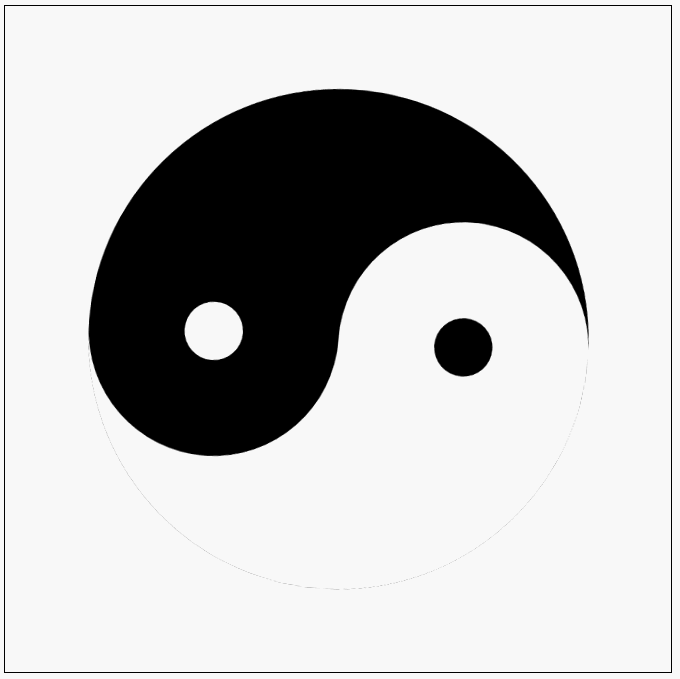

# taichi


> Don't stare at the logo, it may make you dizzy.

 A(n) (combinition of) interesting UI widget(s).

## 1.How to use

> because I upload package to pub.dev failed, so just ```github``` is supported.

```
taichi:
    git:
        url: https://github.com/guchengxi1994/taichi
        ref: stable
```

## 2. Features

### 2.1 draw a simple taichi graph

> parameter ```size``` is required.

```dart
class MainPage extends StatelessWidget {
  @override
  Widget build(BuildContext context) {
    return Scaffold(
      body: TaichiGraph.simple(size: 300),
    );
  }
}
```

### 2.2 draw a custom taichi graph

> parameter ```size``` is required.
> others are optional

``` dart
class MainPage extends StatelessWidget {
  @override
  Widget build(BuildContext context) {
    return Scaffold(
      body: TaichiGraph.custom(
              size: 300,
              color1: Colors.amber,
              color2: Colors.indigo,
              angle: 180,
            ),
    );
  }
}
```

### 2.3 draw a taichi graph from style

```dart
class MainPage extends StatelessWidget {
  @override
  Widget build(BuildContext context) {
    TaichiGraphStyle style = TaichiGraphStyle(
      color1: Colors.amber,
      color2: Colors.indigo,
      dotFactor: 0.15,
      dotColor1: Colors.brown,
      dotColor2: Colors.deepOrange,
      size: 400,
      angle: 45,
    );

    return Scaffold(
      body: SingleChildScrollView(
        child: TaichiGraph.fromStyle(style),
      ),
    );
  }
}
```

|  |  |  |
| ------------------------------------------------------------ | ------------------------------------------------------------ | ------------------------------------------------------------ |

