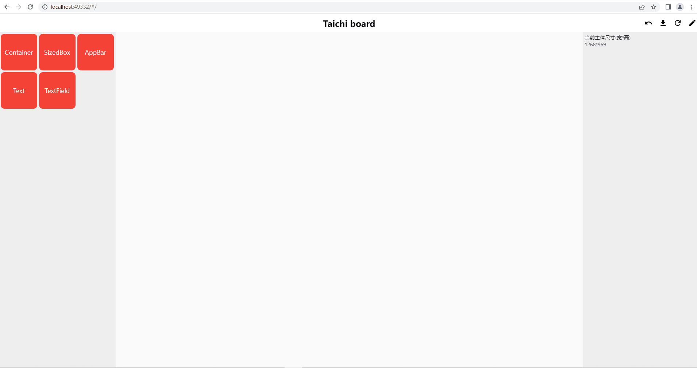
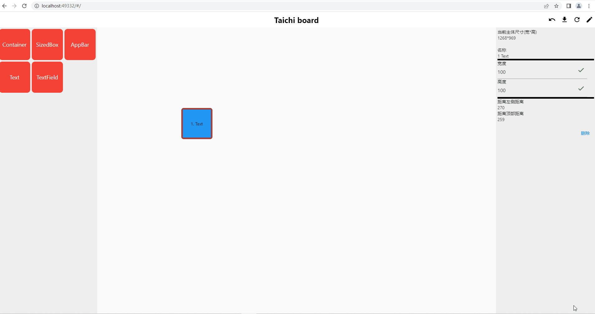
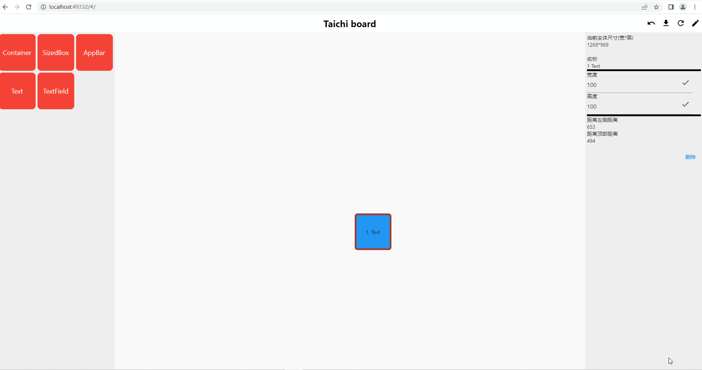

## 基于flutter的UI设计转代码工具

### 1.功能

- [ ] 1.UI转json
- [ ] 2.json转UI
- [ ] 3.UI转dart代码

> - [x] stack样式页面转换
> - [ ] ...

- [ ] 4.UI大小自适应适配
- [ ] 5.支持自定义的widget类型

> - [x] Container
> - [x] SizedBox
> - [x] AppBar
> - [x] Text
> - [x] TextField
> - [ ] ...

- [ ] 6.支持的页面样式

> - [x] Stack
> - [ ] Scroll
> - [ ] Row
> - [ ] Column
> - [ ] ...

- [ ] 7.组件之间关联

- [ ] 8.组件树展示

- [x] 9.回退功能

  > 最多回退5个操作

- [ ] 10.多样化的组件属性

> - [x] width
> - [x] height
> - [x] position(offset)
> - [x] 添加
> - [x] 删除（visible）
> - [ ] ...

#### 2.依赖

```provider```

其它自己写的widget

#### 3.功能展示

* 添加一个widget

  

> 通过拖动左侧 组件类 到工作板上，然后可以对组件进行属性修改。**由于当前（alpha+2）版本下，还只支持stack组件中添加组件（可以包含appbar，但是当前只能存在一个appbar），所以能够修改的属性很少，**演示中是展示了一个组件创建与删除，以及撤销删除操作的过程。
>
> ***创建组件是不会存入操作记录的***

* 修改widget属性


> 通过右侧工具栏，修改组件长宽属性

* 修改widget位置



> 直接在工作板上拖动就可以了，组件拖动，右侧的组件属性栏目会同步修改

* 保存```dart``` 文件



> 可以生成对应的 dart 文件（应该是可以运行的 😁）

#### 4.在线demo

[demo](https://guchengxi1994.github.io/taichi_board/)

