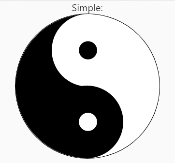
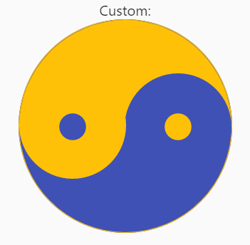
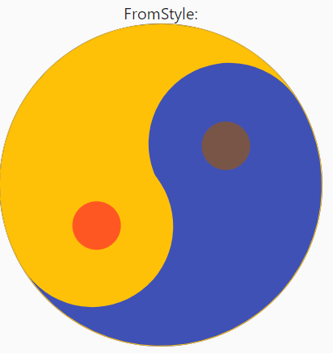
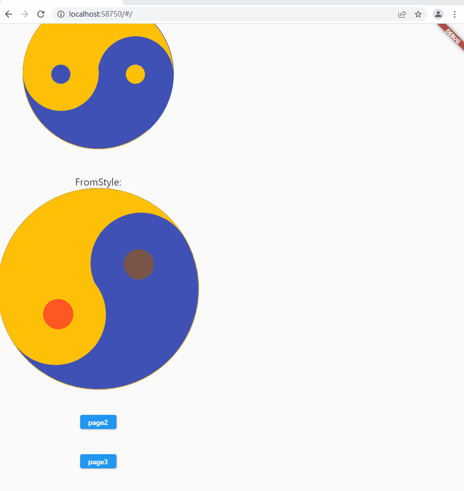
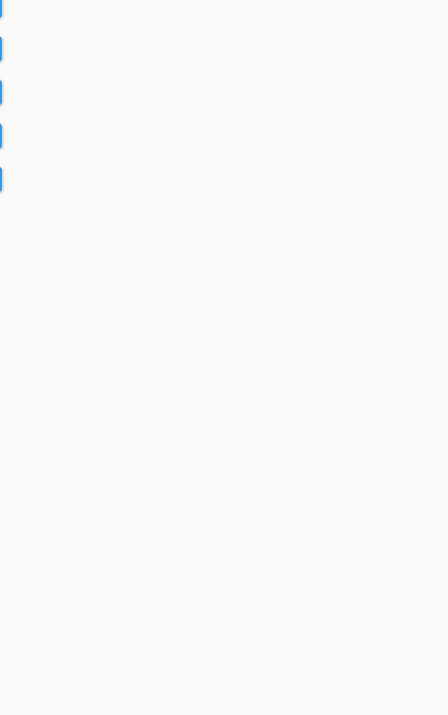
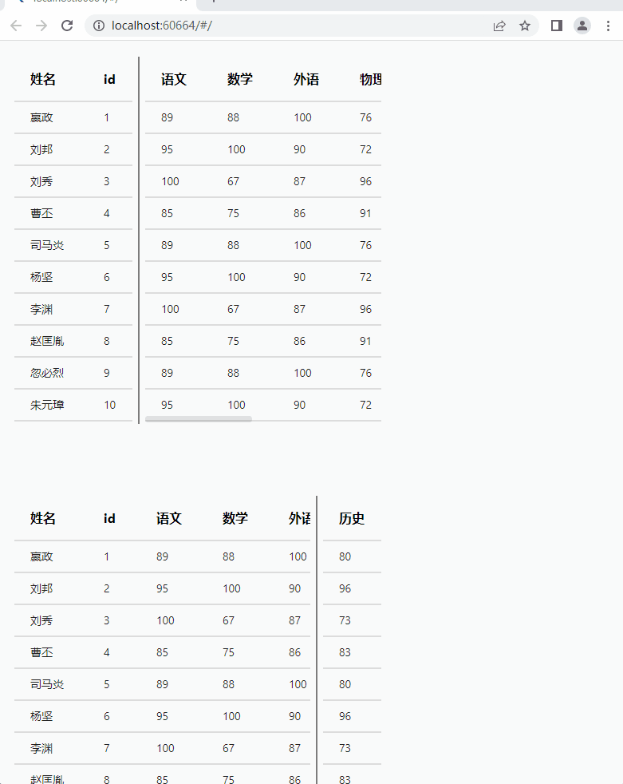
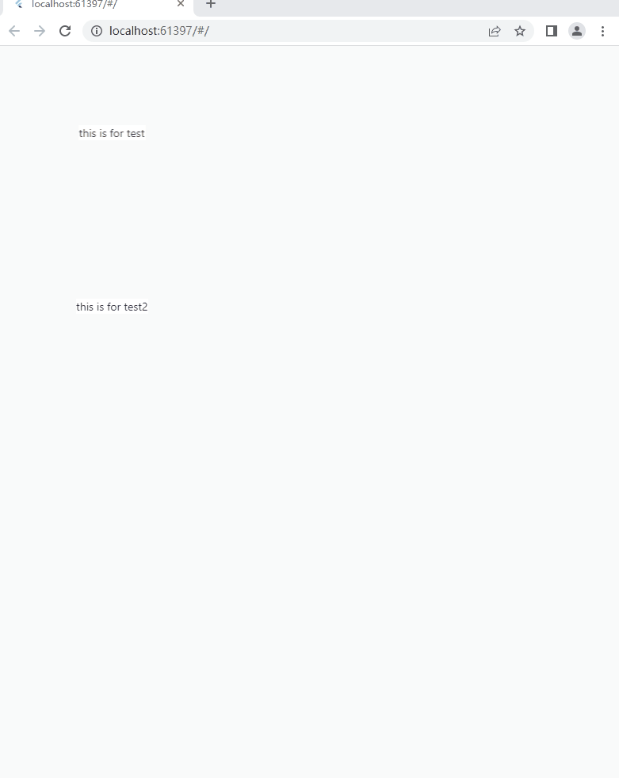
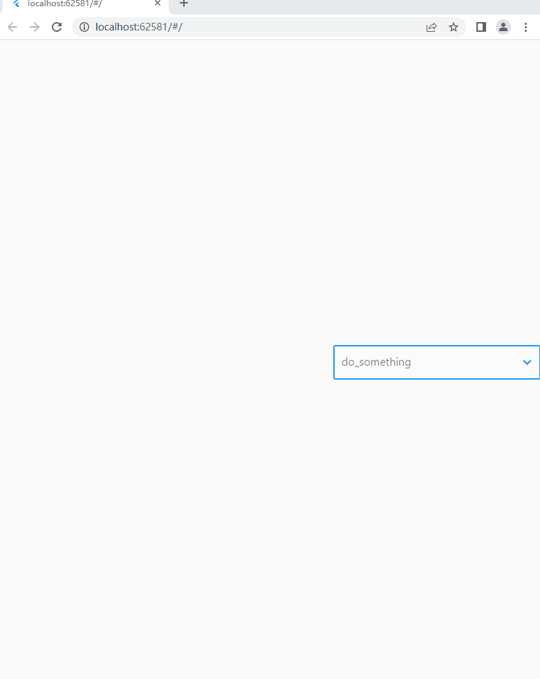
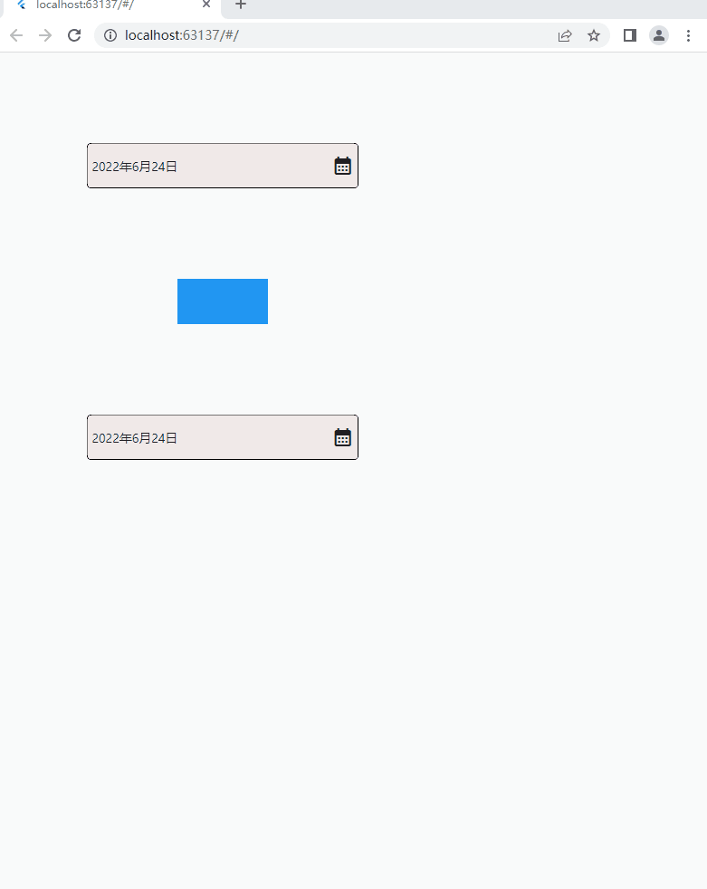

# 支持的特性

## 1. Taichi related

### 1.1 画一个简单而又普通的太极图

<details>
  <summary>
    代码样例：
  </summary>


> 需要填入 ```size``` 参数.

```dart
import 'package:flutter/material.dart';
import 'package:taichi/taichi.dart';

class MainPage extends StatelessWidget {
  @override
  Widget build(BuildContext context) {
    return Scaffold(
      body: TaichiGraph.simple(size: 300),
    );
  }
}
```

</details>

### 1.2 画一个自定义的太极图

<details>
  <summary>
    代码样例：
  </summary>


> 参数 ```size``` 是必须的.
> 其它随意

``` dart
import 'package:flutter/material.dart';
import 'package:taichi/taichi.dart';

class MainPage extends StatelessWidget {
  @override
  Widget build(BuildContext context) {
    return Scaffold(
      body: TaichiGraph.custom(
              size: 300,
              color1: Colors.amber,
              color2: Colors.indigo,
              angle: 180,
            ),
    );
  }
}
```

</details>

### 1.3 定义一个自定义太极图样式


<details>
  <summary>
    代码样例：
  </summary>


```dart
import 'package:flutter/material.dart';
import 'package:taichi/taichi.dart';

class MainPage extends StatelessWidget {
  @override
  Widget build(BuildContext context) {
    TaichiGraphStyle style = TaichiGraphStyle(
      color1: Colors.amber,
      color2: Colors.indigo,
      dotFactor: 0.15,
      dotColor1: Colors.brown,
      dotColor2: Colors.deepOrange,
      size: 400,
      angle: 45,
    );

    return Scaffold(
      body: TaichiGraph.fromStyle(style),
    );
  }
}
```

</details>

#### 看以上的效果

|  |  |  |
| ------------------------------------------------------------ | ------------------------------------------------------------ | ------------------------------------------------------------ |

### 1.4 自动旋转的太极图

> 这里用了第三方package ```provider```

<details>
  <summary>
    代码样例：
  </summary>


> 参数 ```size``` 是必须的.

```dart
import 'package:flutter/material.dart';
import 'package:taichi/taichi.dart';

class Page2 extends StatelessWidget {
  const Page2({Key? key}) : super(key: key);

  @override
  Widget build(BuildContext context) {
    return Scaffold(
      body: Center(
        child: TaichiAutoRotateGraph.simple(size: 100),
      ),
    );
  }
}
```


</details>

### 1.5 基于会自动旋转的太极图的载入动画

<details>
  <summary>
    代码样例：
  </summary>


```dart
import 'package:flutter/material.dart';
import 'package:taichi/taichi.dart';

class Page3 extends StatefulWidget {
  const Page3({Key? key}) : super(key: key);

  @override
  State<Page3> createState() => _Page3State();
}

class _Page3State extends State<Page3> {
  bool isLoading = false;

  @override
  Widget build(BuildContext context) {
    return TaichiOverlay.simple(
        isLoading,
        Scaffold(
          appBar: AppBar(
              leading: IconButton(
            icon: const Icon(Icons.arrow_left),
            onPressed: () {
              Navigator.of(context).pop();
            },
          )),
          body: SizedBox(
            height: 100,
            width: 200,
            child: ElevatedButton(
              onPressed: () {
                setState(() {
                  isLoading = !isLoading;
                });
                Future.delayed(const Duration(milliseconds: 2000))
                    .then((value) {
                  setState(() {
                    isLoading = !isLoading;
                  });
                });
              },
              child: const Text("change state"),
            ),
          ),
        ));
  }
}
```


</details>

### 1.6 自定义旋转太极图

<details>
  <summary>
    代码样例：
  </summary>
</details>


### 1.7 基于1.6的载入动画

<details>
  <summary>
    代码样例：
  </summary>
</details>


### 1.8 分裂的太极图 （整活第一步）

<details>
  <summary>
    代码样例：
  </summary>


  ``` dart
import 'package:flutter/material.dart';
import 'package:taichi/taichi.dart';

class Page4 extends StatelessWidget {
  const Page4({Key? key}) : super(key: key);

  @override
  Widget build(BuildContext context) {
    return Scaffold(
      body: Center(
        child:
            TaichiGraph.splited(color: Colors.blue, size: 500, gradient: true),
      ),
    );
  }
}
  ```


</details>

### 1.9 写轮眼 （整活第二步）

<details>
  <summary>
    代码样例：
  </summary>


  ``` dart
import 'package:flutter/material.dart';
import 'package:taichi/taichi.dart';

class Page5 extends StatelessWidget {
  const Page5({Key? key}) : super(key: key);

  @override
  Widget build(BuildContext context) {
    return Scaffold(
      body: Center(
        child: Container(
          color: Colors.white,
          child: TaichiGraph.uchiha(size: 100),
        ),
      ),
    );
  }
}
  ```


</details>

### 1.10 动态加载

> 参数表
> double initialValue ， 进程初始值，值域 0~100,
>
> double width ， 组件宽度 默认 80,
>
> double height ， 组件高度，默认 160,
>
> Color frontColor ，组件前景颜色（会随着进程改变的区域），默认是深蓝色 
>
> Color backColor ，组件背景颜色，默认为蓝色 
>
> double? duration, 如果定义了这个参数，代表会动态更新进程值，否则是静态的
>
> double? percentageValue 如果定义了duration参数，这个值的初始值就是initialValue的值，然后随着时间推移发生变化（基于provider）；如果没有定义duration参数，那么initialValue失效，静态展示的是这个值
>
> double maxVal ，进程最大值，0~100%，默认 100,
>
> double minVal ，进程最小值，默认为0

> 当前这个还只支持胶囊形状的container,后续考虑拓展一下形状

<details>
  <summary>
    代码样例：
  </summary>


``` dart
import 'package:flutter/material.dart';
import 'package:taichi/taichi.dart';

class Page6 extends StatelessWidget {
  const Page6({Key? key}) : super(key: key);

  @override
  Widget build(BuildContext context) {
    return Scaffold(
      appBar: AppBar(
          leading: IconButton(
        icon: const Icon(Icons.arrow_left),
        onPressed: () {
          Navigator.of(context).pop();
        },
      )),
      body: Column(
        mainAxisAlignment: MainAxisAlignment.center,
        children: [
          Center(
            child: ProcessLoader.customWaveLoader(
                percentageValue: 30,
                maxVal: 80,
                backColor: const Color.fromARGB(255, 200, 43, 43),
                frontColor: const Color.fromARGB(255, 7, 255, 156)),
          ),
          const SizedBox(
            height: 50,
          ),
          Center(
            child: ProcessLoader.customWaveLoader(
                percentageValue: 30,
                duration: 2,
                maxVal: 80,
                backColor: Colors.white,
                frontColor: Colors.amber),
          ),
          const SizedBox(
            height: 50,
          ),
          Center(
            child: ProcessLoader.customWaveLoader(
                percentageValue: 30,
                duration: 5,
                maxVal: 100,
                backColor: const Color.fromARGB(255, 255, 255, 255),
                frontColor: const Color.fromARGB(255, 38, 68, 138)),
          ),
        ],
      ),
    );
  }
}
```



</details>

## 2. 日历/日程（calendar_view）
...

## 3. 自定义表格（[custom_data_table](taichi_core/lib/src/UI/custom_data_table/custom_data_table.dart)）

<details>
  <summary>
    代码样例：
  </summary>


``` dart
class MyApp extends StatelessWidget {
  const MyApp({Key? key}) : super(key: key);

  @override
  Widget build(BuildContext context) {
    List<TabelDataModel> gradesList = [
      TabelDataModel('嬴政', 1, 89, 88, 100, 76, 81, 77, 95, 85, 80),
      TabelDataModel('刘邦', 2, 95, 100, 90, 72, 65, 88, 66, 79, 96),
      TabelDataModel('刘秀', 3, 100, 67, 87, 96, 89, 69, 79, 78, 73),
      TabelDataModel('曹丕', 4, 85, 75, 86, 91, 100, 66, 100, 90, 83),
      TabelDataModel('司马炎', 5, 89, 88, 100, 76, 81, 77, 95, 85, 80),
      TabelDataModel('杨坚', 6, 95, 100, 90, 72, 65, 88, 66, 79, 96),
      TabelDataModel('李渊', 7, 100, 67, 87, 96, 89, 69, 79, 78, 73),
      TabelDataModel('赵匡胤', 8, 85, 75, 86, 91, 100, 66, 100, 90, 83),
      TabelDataModel('忽必烈', 9, 89, 88, 100, 76, 81, 77, 95, 85, 80),
      TabelDataModel('朱元璋', 10, 95, 100, 90, 72, 65, 88, 66, 79, 96),
      TabelDataModel('皇太极', 11, 100, 67, 87, 96, 89, 69, 79, 78, 73),
    ];

    return MaterialApp(
      debugShowCheckedModeBanner: false,
      home: Scaffold(
        body: SingleChildScrollView(
          child: Column(
            children: [
              /// fixHead
              CustomDataTable(
                datas: gradesList,
                fixHead: true,
                seprateIndexes: const [2],
              ),
              const SizedBox(
                height: 50,
              ),

              /// fixTail
              CustomDataTable(
                datas: gradesList,
                fixTail: true,
                seprateIndexes: [gradesList.length - 2],
              ),
              const SizedBox(
                height: 50,
              ),

              /// fixBoth
              CustomDataTable(
                datas: gradesList,
                fixTail: true,
                fixHead: true,
                seprateIndexes: [1, gradesList.length - 2],
              )
            ],
          ),
        ),
      ),
    );
  }
}

class TabelDataModel extends BaseData {
  String name;
  int studentId;
  int language;
  int math;
  int english;
  int physical;
  int chemistry;
  int biological;
  int geography;
  int political;
  int history;
  bool isSelected;

  TabelDataModel(
    this.name,
    this.studentId,
    this.language,
    this.math,
    this.english,
    this.physical,
    this.chemistry,
    this.biological,
    this.geography,
    this.political,
    this.history, {
    this.isSelected = false,
  });

  @override
  Map<String, dynamic> toMap() {
    return {
      "姓名": name,
      "id": studentId,
      "语文": language,
      "数学": math,
      "外语": english,
      "物理": physical,
      "化学": chemistry,
      "生物": biological,
      "地理": political,
      "历史": history
    };
  }
}
```

</details>




## 4. 自定义tooltip（[custom_tooltip](taichi_core/lib/src/UI/custom_tooltip/custom_tooltip.dart)）

<details>
  <summary>
    代码样例：
  </summary>


``` dart
class MyApp extends StatelessWidget {
  const MyApp({Key? key}) : super(key: key);

  @override
  Widget build(BuildContext context) {
    return MaterialApp(
      debugShowCheckedModeBanner: false,
      home: Scaffold(
        body: SingleChildScrollView(
          child: Column(
            crossAxisAlignment: CrossAxisAlignment.center,
            children: [
              Padding(
                padding: const EdgeInsets.all(100),
                child: CustomTooltip(
                  tooltip: Container(
                    color: Colors.transparent,
                    // color: Colors.blue,
                    width: 100,
                  ),
                  child: const Text("this is for test"),
                ),
              ),
              Padding(
                padding: const EdgeInsets.all(100),
                child: CustomTooltip(
                  howToolTipShow: HowToolTipShow.onMouseHover,
                  tooltip: Container(
                    color: Colors.transparent,
                    // color: Colors.blue,
                    width: 100,
                  ),
                  child: const Text("this is for test2"),
                ),
              ),
            ],
          ),
        ),
      ),
    );
  }
}
```

</details>



## 5. 下拉搜索([dropdown_search](taichi_core/lib/src/UI/dropdown_search/dropdown_search.dart))

<details>
  <summary>
    代码样例：
  </summary>


``` dart
class HomePage extends StatefulWidget {
  const HomePage({Key? key}) : super(key: key);

  @override
  State<HomePage> createState() => _HomePageState();
}

class _HomePageState extends State<HomePage> {
  final List<String> l = ["I", "love", "China"];
  final TextEditingController controller = TextEditingController();

  @override
  Widget build(BuildContext context) {
    return Scaffold(
      body: Row(
        children: [Expanded(child: Container()), DropDownSearch(datas: l)],
      ),
    );
  }
}

// ignore: must_be_immutable
class MyApp extends StatelessWidget {
  const MyApp({Key? key}) : super(key: key);

  @override
  Widget build(BuildContext context) {
    return const MaterialApp(
      debugShowCheckedModeBanner: false,
      home: HomePage(),
    );
  }
}
```

</details>



## 日期选择器([simple_date_picker](taichi_core/lib/src/UI/simple_date_picker/taichi_simple_date_picker.dart))

<details>
  <summary>
    代码样例：
  </summary>


``` dart
class MyApp extends StatelessWidget {
  const MyApp({Key? key}) : super(key: key);

  @override
  Widget build(BuildContext context) {
    return MaterialApp(
      debugShowCheckedModeBanner: false,
      home: Scaffold(
        body: SingleChildScrollView(
          child: Column(
            crossAxisAlignment: CrossAxisAlignment.center,
            children: [
              Padding(
                padding: const EdgeInsets.all(100),
                child: SimpleDatePicker(),
              ),
              Container(
                width: 100,
                height: 50,
                color: Colors.blue,
              ),
              Padding(
                padding: const EdgeInsets.all(100),
                child: DatePickerWithOverlay(),
              ),
            ],
          ),
        ),
      ),
    );
  }
}
```

</details>



> 两种是不一样的实现方法，一种是基于Visibility,另一种是基于Overlay
